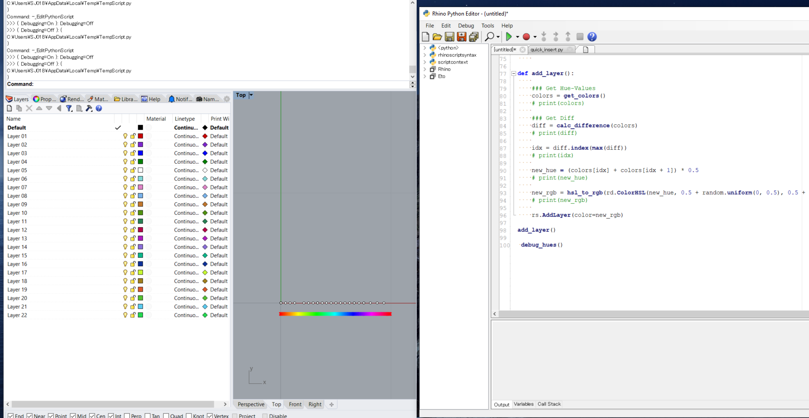

# Create_Layer_with_Random_Color  

補助線の作図など新規レイヤーを作成するときに、毎回毎回黒のレイヤーになり、補助線とそれから作った切断用ソリッドなどが分かりにくい。レイヤーを新規作成する際に今あるレイヤーとは別の色でレイヤーを作成する。  

  

モチベーションはまさしくこれ↓。  

[https://discourse.mcneel.com/t/new-layer-with-random-color/13917/17](https://discourse.mcneel.com/t/new-layer-with-random-color/13917/17)  

ポイント
- 黄色は選択状態と被るので避ける  
- RGB を HSL 色空間に置き換えて、H の値で既存の色を避ける  

面倒  
- RhinoCommon で ColorARGB が 7 以降で実装されているらしく6では使えない  
- HSL を rhinoscriptsyntax の関数では HLS となっていてうれしくない  

### Ref  

- ColorRGBToHLS (rhinoscriptsyntax)  
  - [https://developer.rhino3d.com/api/RhinoScriptSyntax/#collapse-ColorRGBToHLS](https://developer.rhino3d.com/api/RhinoScriptSyntax/#collapse-ColorRGBToHLS)  

- ColorHLSToRGB (rhinoscriptsyntax)  
  - [https://developer.rhino3d.com/api/RhinoScriptSyntax/#collapse-ColorHLSToRGB](https://developer.rhino3d.com/api/RhinoScriptSyntax/#collapse-ColorHLSToRGB)  

- Rhino_Display_ColorHSL (RhinoCommon)  
  - [https://developer.rhino3d.com/api/RhinoCommon/html/T_Rhino_Display_ColorHSL.htm](https://developer.rhino3d.com/api/RhinoCommon/html/T_Rhino_Display_ColorHSL.htm)  

- HSL and HSV (Wikipedia)  
  - [https://en.wikipedia.org/wiki/HSL_and_HSV](https://en.wikipedia.org/wiki/HSL_and_HSV)  

