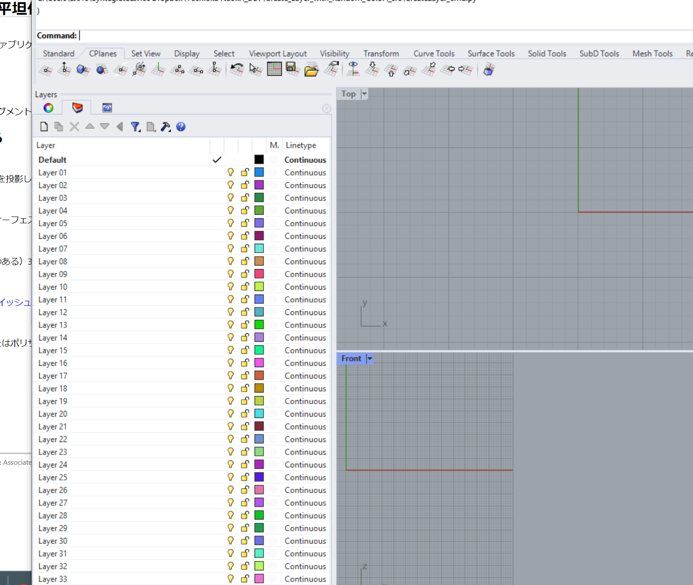
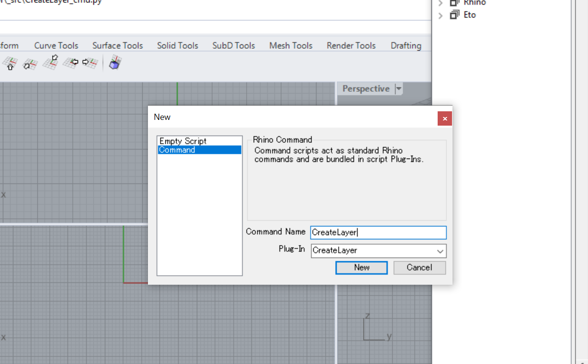

# Create_Layer_with_Random_Color  

ライノで新規レイヤーを作成するときに毎回毎回黒のレイヤーになる。  
補助線とそれから作った切断用ソリッドなどがすべて同じ色ではわかりにくく不便。  
レイヤーを新規作成する際に今あるレイヤーとは別の色でレイヤーを作成する（イラレなどはこうですね）。  

  

## How to Use  

// 20240211  
インストーラを作成しました。下記を確認ください。  
[https://github.com/naysok/Create_Layer_with_Random_Color/releases/](https://github.com/naysok/Create_Layer_with_Random_Color/releases/)  

ライノのコマンド作成は、PythonEdtor から New >> Command で以下の写真のように設定する。  
そこに [_src/CreateLayer_cmd.py](https://github.com/naysok/Create_Layer_with_Random_Color/blob/main/_src/CreateLayer%EF%BC%BFcmd.py) の中身をコピペしスクリプトを実行すると、コマンドが作成されるはず。  

  

## Motivation  

まさしくこのスレッド↓。  
[https://discourse.mcneel.com/t/new-layer-with-random-color/13917/17](https://discourse.mcneel.com/t/new-layer-with-random-color/13917/17)  

プラグインが置かれているが Rhino6 では動かないらしい。
また、個人的には選択用の黄色などは避けたいし、今の色が無いところを探してその色にしてほしい。  

## 動作環境  

- Rhino6 WINDOWS  
- Rhino7 WINDOWS  
// そのほかは未確認  

## ポイント  

- 黄色は選択状態と被るので避ける  
- RGB を HSL 色空間に置き換えて、H の値で既存の色を避ける（これならば 1軸）  
  - RGB の三次元空間を評価するのが面倒  

## 面倒  

- RhinoCommon で ColorARGB が Rhino7 以降で実装されているらしく Rhino6 では使えない  
- HSL を rhinoscriptsyntax の関数では HLS となっていてうれしくない  

## Ref  

- ColorRGBToHLS (rhinoscriptsyntax)  
  - [https://developer.rhino3d.com/api/RhinoScriptSyntax/#collapse-ColorRGBToHLS](https://developer.rhino3d.com/api/RhinoScriptSyntax/#collapse-ColorRGBToHLS)  

- ColorHLSToRGB (rhinoscriptsyntax)  
  - [https://developer.rhino3d.com/api/RhinoScriptSyntax/#collapse-ColorHLSToRGB](https://developer.rhino3d.com/api/RhinoScriptSyntax/#collapse-ColorHLSToRGB)  

- Rhino_Display_ColorHSL (RhinoCommon)  
  - [https://developer.rhino3d.com/api/RhinoCommon/html/T_Rhino_Display_ColorHSL.htm](https://developer.rhino3d.com/api/RhinoCommon/html/T_Rhino_Display_ColorHSL.htm)  

- HSL and HSV (Wikipedia)  
  - [https://en.wikipedia.org/wiki/HSL_and_HSV](https://en.wikipedia.org/wiki/HSL_and_HSV)  

